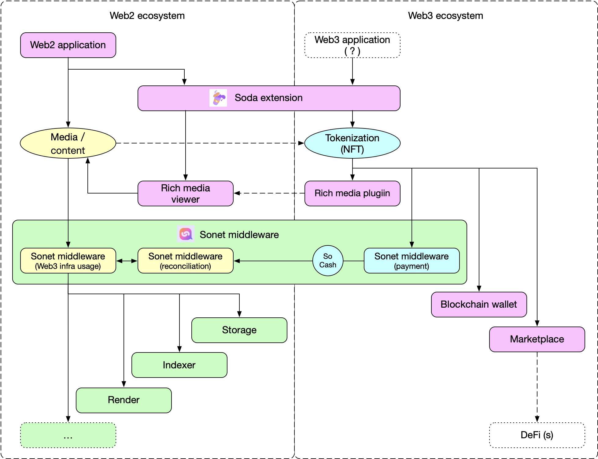

# Soda Extension

Soda extension is part of Sonet infrastructure.

Soda extension serves as a personal asset portal for the Web (World Wide Web). Build a socially forward metaverse where assets derive value from communal activity.
Soda is an open-source project targeting to unlock meaningful value from all social creation, and provide  personal portal for end users.
The system builds a socially forward ecosystem where assets derive value from communal activity through a dual coin system balanced by social usage.
Web users use webapps to establish communications and to get useful information.

Soda Extension is assigning value to social activity by bringing NFTs to Web 2.0 in a frictionless way. This seamlessly allows web users to manage their online resources, including their personal account(s) and data, generated by/published to any online systems within a one-stop self-sovereign application.

Soda extension is able to add new Web2 applications, rich medias, marketplaces in Web3, or Web3 blockchain wallets, which is opened to the Sonet development community.